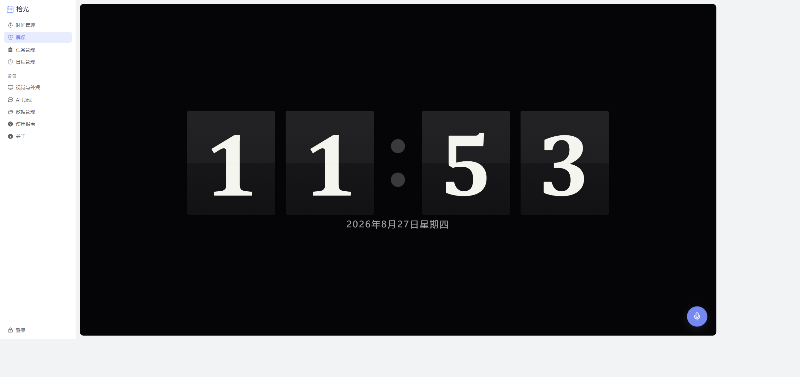

# 拾光 Shiguang

> AI 驱动的日历待办应用，捡拾时光。



一份 Vue 3 代码，三端交付：**Web**（浏览器直接用）、**Electron 桌面**（托盘常驻 + 自动更新）、
**Android**（Capacitor 原生壳 + 系统闹钟提醒）。local-first 设计——数据存在本机，
断网完全可用，登录账号只为多端云同步。

## 功能特性

**任务域**

- 任务树（最多 3 级父子层级），待办栏只列叶子任务
- 四象限法则（艾森豪威尔矩阵）：重要 × 紧急双轴，矩阵内拖拽排序
- 树 / 四象限 / 卡片多视图，Fuse.js 模糊搜索
- 完成态联动：完成下推子孙、取消上推祖先

**日程域**

- FullCalendar 日 / 周 / 月视图，拖选时段即新建
- 拖拽调度（移动 / 缩放 / 跨日），跨零点自动校验回滚
- 日程可关联任务，支持从任务一键排期
- 日程管理页：表 / 卡片双布局，状态与颜色筛选

**AI 语音助手**

- 语音录入待办与日程：说一句话，自动解析成结构化的任务 / 日程（含四象限归属）
- 云端模式：自带 Key，兼容 OpenAI 接口规范的任意服务商；本地模式：WebLLM 浏览器内推理，断网可用
- **API Key 只存本机，永不进入同步通道**

**同步域**

- 记录级 local-first 同步：LWW 双时间戳（编辑时刻裁决 / 服务端时钟做拉取游标）、墓碑传播删除
- SSE 实时信令：对端修改秒级唤醒；断线自适应降级轮询
- 设置按字段记录化——改主题色不会覆盖你同时改过的时段偏好
- 数据管理页：文件导入导出备份、云端恢复、服务器地址可配置

**体验**

- 游客全功能（不强制登录）；深浅双主题；桌面屏保模式（翻页时钟 + 语音入口）
- 移动端适配：抽屉导航、手势关闭浮层、卡片视图、滑动唤出屏保

## 技术栈

| 层 | 技术 |
|---|---|
| 前端 | Vue 3 `<script setup>` + TypeScript + Vite + Pinia + Element Plus + FullCalendar |
| 后端 | Express 5 + `node:sqlite`（Node ≥ 22）；零 npm 运行时依赖哲学——JWT / 滑块验证码 / PNG 验证码图全手写 |
| 桌面 | Electron（electron-builder + NSIS，electron-updater 通用 feed 自动更新） |
| 安卓 | Capacitor（系统闹钟精确提醒、电池优化豁免引导、沉浸式屏保） |

## 快速开始

环境要求：Node ≥ 22（后端依赖 `node:sqlite`）。

```bash
# 前端（http://localhost:5177，/api 自动代理到本地后端）
npm install
npm run dev

# 后端（监听 127.0.0.1:8787）
cd server
npm install
npm run dev
```

只跑前端也可以——游客模式全功能可用，数据存 localStorage。

后端环境变量（均可选）：

| 变量 | 说明 |
|---|---|
| `PORT` | 监听端口，默认 8787 |
| `INVITE_CODE` | 设置后注册需邀请码 |
| `ADMIN_USERS` | 管理员邮箱（逗号分隔） |
| `SMTP_HOST/PORT/USER/PASS/FROM` | 验证码邮件发信；未配置时验证码打印到服务端日志（检索 `[mail-code]`） |

JWT 密钥自动生成于 `server/data/secret.key`（已 gitignore）。

### 测试

```bash
npm test          # 前端（node:test + tsx）
cd server && npm test
```

### 桌面端

```bash
npm run electron:dev     # 开发（构建 + Electron 壳）
npm run electron:build   # Windows NSIS 安装包
```

### Android

```bash
npm run build && npx cap sync android
# 用 Android Studio 打开 android/
```

### 生产部署

Vite `base: './'` 相对路径，一份 dist 产物桌面 / Web 两用。nginx 参考配置见
[deploy/nginx-shiguang.conf](deploy/nginx-shiguang.conf)：静态 SPA + `/api` 反代本机 Node +
`/updates/` 桌面自动更新源，三角色一个 server 块。

## 文档

- [docs/README.md](docs/README.md) — 文档中心与组织约定
- [docs/features.md](docs/features.md) — 产品能力清单（随功能上线同步更新）
- [docs/sync/](docs/sync/current.md) — 同步域：当前态 / 演进史 / ADR 决策记录
- [CLAUDE.md](CLAUDE.md) — 面向 AI 协作与贡献者的项目须知（目录速览、不变量、踩坑清单）

## License

[MIT](LICENSE)
